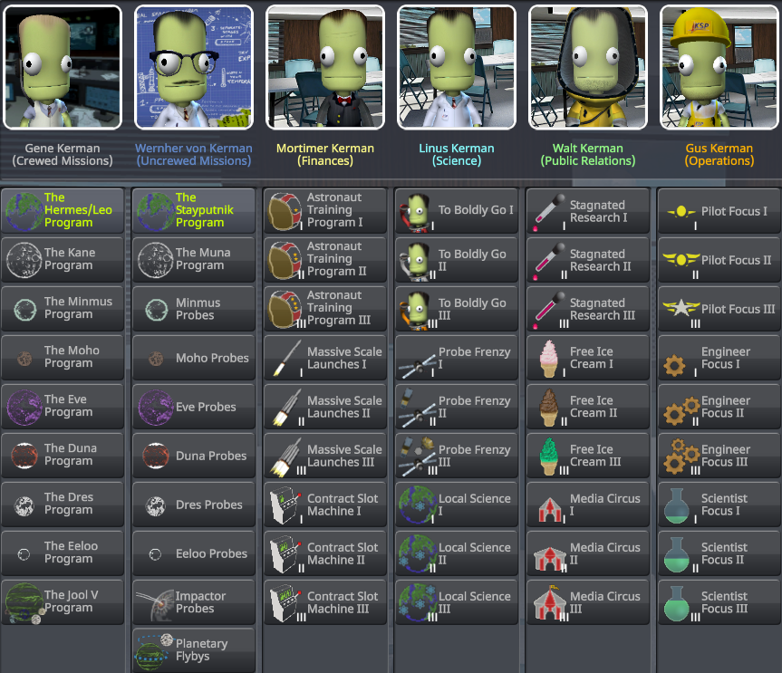

# ReStrategia

ReStrategia is a Kerbal Space Program (KSP) mod that extends and continues the original [Strategia](https://github.com/jrossignol/Strategia) mod.

## Description

ReStrategia is a revamp to Kerbal Space Program's strategy system. All the stock strategies are removed, and replaced with new and unique strategies.

## Special Mission Strategies

The first set of strategies are special mission strategies. These strategies will give you advance cash and bonuses to certain milestones for completing a high level objective as part of your space program. They are dynamic, so they will work with mods that change the stock solar system by adding or changing celestial bodies.  Be warned though - if you cancel one of these strategies without completing the objective, you will face a heavy penalty!

### Crewed Missions

Once we've proven we can get a Kerbal to orbit and back, we need to continue to break new barriers.  We have a choice of nearby bodies that we can get to.  We choose to go to <insert celestial body here>, not because it is easy, but because it is hard.

### Uncrewed Missions

The costs of sending a Kerbal to another planet are astronomical compared to those of sending a probe that we can leave behind.  Why don't we send some probes to our neighbouring planets to gather science autonomously for us?

## Standard Strategies

The remaining strategies are the standard strategies - these give a bonus while active, and can be active for as long as you like.

### Astronaut Training Program

Our standard training procedure is to treat newly hired astronauts as a disposable commodity to greatly reduce the cost of unscheduled disassemblies. Still, some argue that training our astronauts before putting them on top of a top of a ton of explosives will result in a lower mission failure rate. The cost of setting up the program will be high, nevermind the cost of actually training the astronauts. What do you say, do we want the right stuff, or the almost-good-enough stuff?

### Massive Scale Launches

We've found some investors who are willing to sponsor us if we're able to launch colossal structures into space in a single launch. We'll have to employ some truly Whackjobian construction techniques to get these things into orbit.

### Contract Slot Machine

These agencies seem to think they're doing us a favour offering by us these ridiculous contracts. Why should we be penalized for being choosy? By closing our books to the public, agencies will have no idea what we're willing to accept. There might be a little chaos in the contracts we see under this model, but if we're only choosing the best ones, then who cares?!?

### To Boldly Go

If we want to get the most research possible done out there, we need to explore as many new biomes as we can. Government grants from exploration programs will ultimately help us fund further exploration and research.

### Probe Frenzy

If we want to do some research, then probes are the way to go. What we save on sending Kerbals out there can be spent on a vast fleet of autonomous probes.

### Local Science

There are so many research opportunities right in our back yard. We should focus on local research to bootstrap our space program. That way when we do make it further out there, we'll be sending the best technology we can.

### Stagnated Research

There are several conservative groups on Kerbin that think we've gone too far, too fast. We're not about to shut down the space program, but maybe slowing down our development of new technology to appease these groups will get us some goodwill and ensure that they don't burn down KSC?

### Free Ice Cream

We've come up with a crazy idea - giving out free ice cream at the space center. The public will absolutely love us. If we push the program far enough, we'll get better rewards for rescuing Kerbals (they'll get ice cream when they land!) and maybe even be able to get a discount on hiring new astronauts. FREE. ICE. CREAM.

### Media Circus

To make a reputable space program, we need to ramp up the media involvement. Cameras everywhere, coverage 6 hours a day, 426 days a years. Of course, this could easily backfire if we have any... accidents.

### Pilot Focus

Clearly the most important role among our astronauts is that of the pilot. Without a skilled pilot, nobody is going to space today (or any other day). Shall we build our space program around our brave pilots?

### Engineer Focus

Where would we be without our engineers? They make sure everything is in order to get the other astronauts up and down safely. Shall we build our space program around the skilled engineer?

### Scientist Focus

The scientist is the key role that we need to focus on. A skilled scientist knows exactly which sample to send back to maximize our science gain (we can only fit so many Mun rocks in those capsules). Shall we build our space program around our brilliant scientists?

## Download

- CKAN: In [CKAN](https://forum.kerbalspaceprogram.com/index.php?/topic/154922-ckan-the-comprehensive-kerbal-archive-network-v1251-broglio/), select and download the mod.
- GitHub: Download the latest release from the [repository releases](https://github.com/MegaPiggy/ReStrategia/releases/latest) and copy the `GameData/ReStrategia` folder into your KSP `GameData` directory. Please ensure you have all the dependencies before making an issue on GitHub:
  - ModuleManager is a required dependency and can be downloaded from its [release thread](https://forum.kerbalspaceprogram.com/index.php?/topic/50533-141-module-manager-306-marsh-14th-2018-its-dangerous-to-go-alone-take-those-cats-with-you/).
  - Contract Configurator is a required dependency and can be downloaded from its [release thread](https://forum.kerbalspaceprogram.com/index.php?/topic/91625-142-contract-configurator-v1250-2018-04-15/).
  - Custom Barn Kit is a required dependency and can be downloaded from its [release thread](https://forum.kerbalspaceprogram.com/index.php?/topic/109027-14-custom-barn-kit-1117-march-10th-parachute-included/).

## Compatibility

- Komplexity
- Kopernicus
- Kopernicus Expansion
- Singularity

## Credits

- Author / Maintainer: `MegaPiggy`
- Original Author: `nightingale`